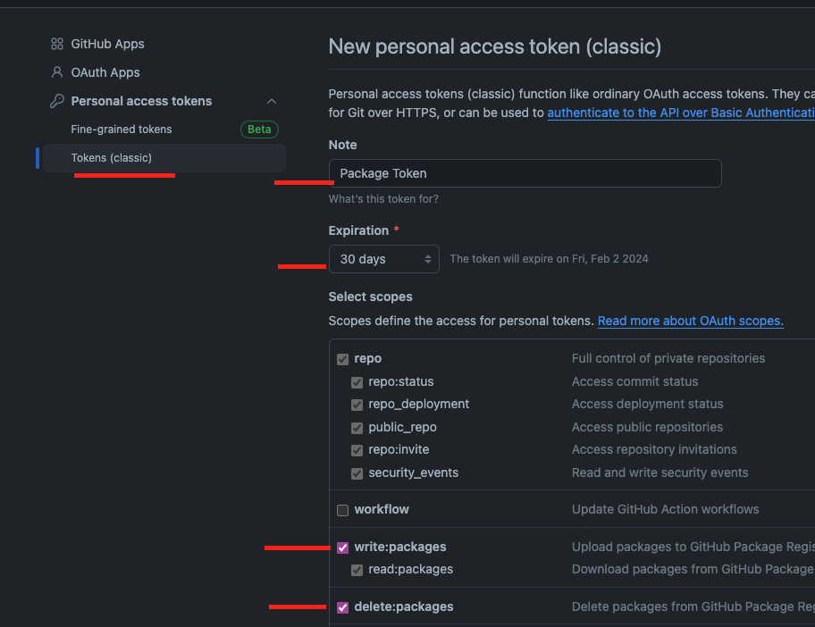

# Instalar paquete usando el registry de githiub package:

## 1- Crear un archivo .npmrc en la raiz del proyecto o con los git actions:
Debes cambiar NAMESPACE por username o el nombre de la org y token por los valores correspondientes.
```text
//npm.pkg.github.com/:_authToken=${NODE_AUTH_TOKEN}
@NAMESPACE:registry=https://npm.pkg.github.com
always-auth=true
```
#### 1.1- En este paso debes crear un token en github, para esto debes ir a la configuracion de tu cuenta, luego a developer settings y por ultimo a personal access tokens.
Debes crear un token con los siguientes permisos:
- repo
- write:packages
- read:packages
- delete:packages


#### 1.2- Luego debes copiar el token y guardarlo en una variable de entorno en github, para esto debes ir a la configuracion del repositorio, luego a secrets y por ultimo a new repository secret.
NODE_AUTH_TOKEN=token


## 2- Instalar el paquete
```bash
npm install @NAMESPACE/REPONAME
```